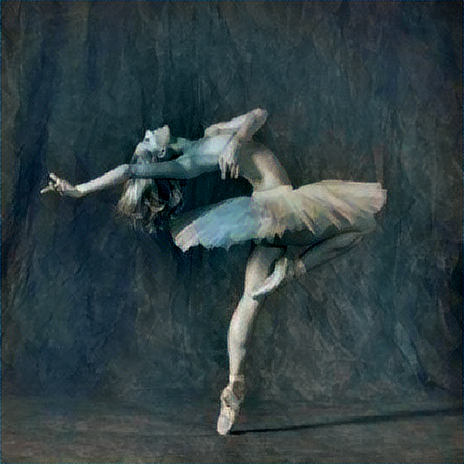

# NeuralStyleTransfer

The algorithm takes in two images, the content image and the style image as the inputs. The ouput is another image which has the characterists of the content image but has been styled in the format of the style image.

# Example
Content Image

  

Style Image

  

Generated Image

 
